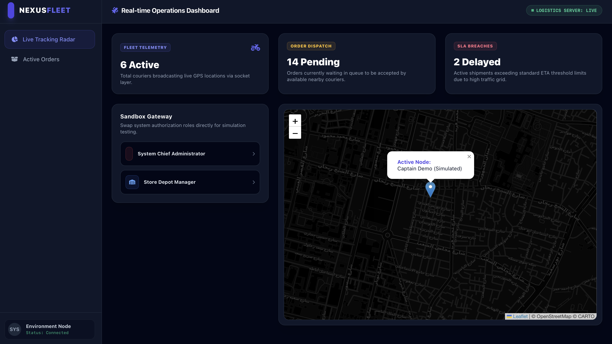
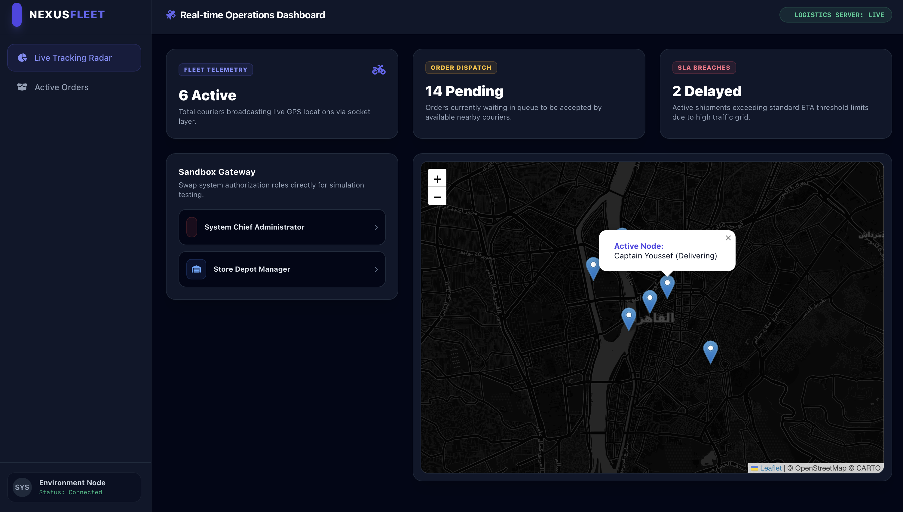

# 🚀 Real-Time Hyperlocal Logistics Radar

An enterprise-grade, full-stack open-source hyperlocal delivery tracking system. This project architecture combines the complex relational business logic of **Laravel 13** with a high-frequency, real-time geospatial tracking microservice powered by **Node.js**, **Socket.io**, and **MongoDB**.

## 📊 Live System Preview
Here is a glimpse of the real-time dark-themed logistics control panel:




## 🛠️ Tech Stack & Microservices
- **Core Operations Panel:** Laravel 13 (PHP 8.x) & Tailwind CSS (Dark Theme Layout).
- **Geospatial Microservice:** Node.js + Express + Socket.io Server (Port 6001).
- **Relational Storage:** MySQL/PostgreSQL (For transactional Users & Orders logic).
- **High-Frequency NoSQL Storage:** MongoDB (Utilizing `2dsphere` geospatial indexing for lightning-fast GPS logging).
- **Mapping Canvas:** JavaScript + Leaflet.js Grid Engine + CartoDB Obsidian Dark Layer.

## 🏁 How to Run the Environment Locally

Follow these terminal commands sequentially across 3 different tabs:

### 1. Boot up the Laravel Application
```bash
cd backend
composer install
php artisan migrate
php artisan view:clear
php artisan serve
